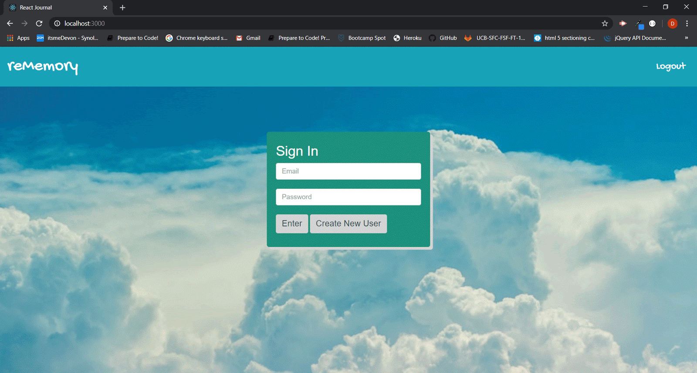
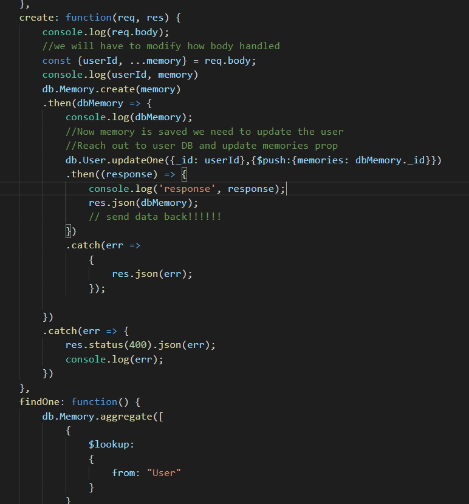
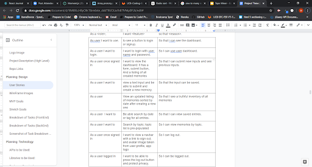

# React Journal: ReMemory

In this project, I created a React journal that allows users to save memories and search for old memories by tags.

## Code Snippets

This is the Memory Controller code which shows the creates one memory and associates the memory to the user via "aggregate". Simply saying here is where I merge two separate tables together by ID. 

Now I understand why the user story plays a big part in the development. The column, I want (feature), gives you a clue on where and what to start on first. If done correctly, it can help create a path on creating a new app. 

## Getting Started

To get started using the application, use any web browser to view live link, (https://dry-wildwood-80906.herokuapp.com/). Repository link, (https://github.com/itsmedexter/React-Journal). If you download the repository, you can use gitbash to run mongod first, by typing in the command line "mongod". Then cd into server and do a "node server" to start server. Then cd into client and do a "npm start". This will automaticly open a browser window and have the application running on localhost:3000.   

## Technolgies Used

* [HTML](https://developer.mozilla.org/en-US/docs/Web/HTML)
* [CSS](https://developer.mozilla.org/en-US/docs/Web/CSS)
* [Bootstrap](https://getbootstrap.com/)
* [NodeJS](https://nodejs.org/en/)
* [React](https://reactjs.org/)

## Deployed Link

* [See Live Site](https://dry-wildwood-80906.herokuapp.com/)

## Authors

Dexter Valencia 

- [Link to Repository Site](https://github.com/itsmedexter/React-Journal)
- [Link to Github](https://github.com/itsmedexter)
- [Link to LinkedIn](https://www.linkedin.com/in/dextervalencia/)

## License

This project is licensed under the MIT License 

## Acknowledgments

* Thanks to Kerwin and Mahisha for helpful hints!  

